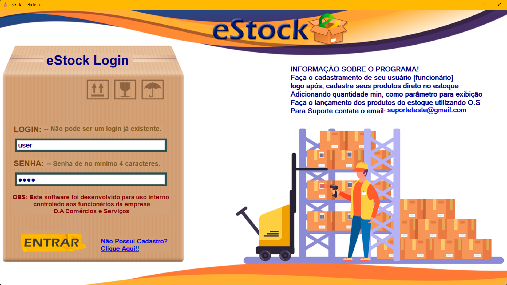
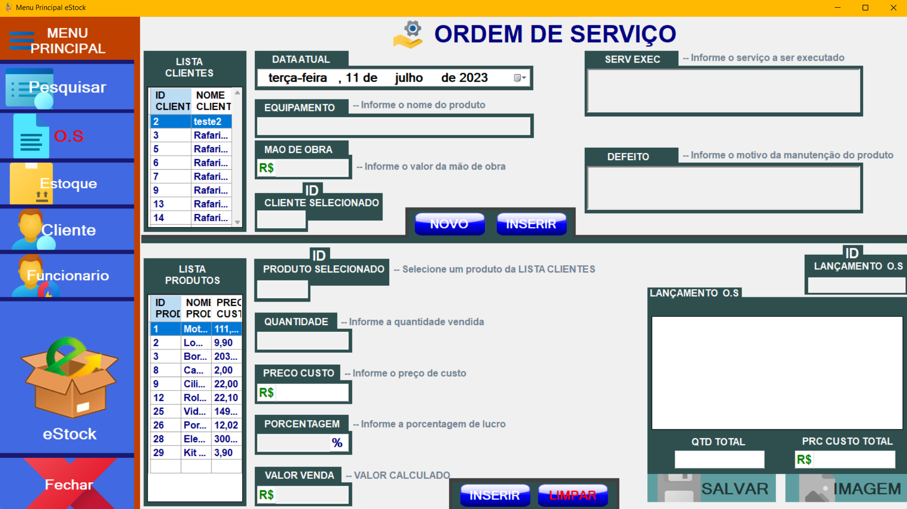
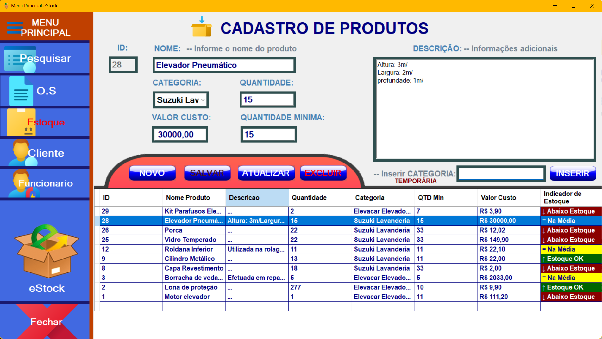

# Desktop Forms Application - README

This is the README file for the Desktop Forms application developed in C# using the MVC (Model-View-Controller) pattern with DAO (Data Access Object).

## Summary

The application is a desktop-based inventory management system designed for small businesses. It was developed based on a real company's request to streamline inventory control and organization.

## Features

The application offers the following features:

- Authentication and Employees:
  - Employee Registration and Login: The application is designed for internal use by employees. Employees can create an account and log in to access the system's features.

- Main Menu:
  - Main Panel:
    - Allows quick insertion of pre-registered products into the inventory without filling out the entire form.
    - Users can select a pre-registered product and specify the quantity to be added to the inventory.

  - Search:
    - Performs a search for all generated service orders.
    - Provides access to relevant information about each service order, such as date, customer, service type, reported defect, and total value.

  - Service Order:
    - Enables the generation of complete service orders.
    - Users can select the customer, provide the date, equipment details, performed service, and reported defect.
    - When entering a service order, users can select the products to be used for repair, automatically deducting the quantity from the company's inventory.
    - The values are automatically calculated, considering the product cost, applying a profit percentage, and factoring in labor costs.
    - The total sale value is displayed.
    - Service orders can be saved for future reference or exported as an image.

  - Inventory:
    - Allows insertion, viewing, updating, and deletion of products managed by the company's inventory.
    - Users can fill in information such as name, category, quantity, cost value, minimum quantity, and description.
    - Temporary categories can also be added.
    - The inventory is visually highlighted with colors indicating whether the quantity is below, equal to, or above the minimum quantity.

  - Customer:
    - Enables insertion, viewing, updating, and deletion of customers who will be selected for service orders.
    - Fields include name, CPF/CNPJ, address, city, and state.

  - Employee:
    - Allows the registration of employees in the system.
    - Fields include name, login, and password.
    - Users can add, view, update, or delete registered employees.

  - Close:
    - Button that closes the current window and returns to the initial registration/login screen of the application.

## Requirements

- Platform: Windows
- IDE: Microsoft Visual Studio.
- Framework: .NET Framework.
- Language: C#

## How to Run

1. Clone the repository to your local machine.
2. Open the project in Microsoft Visual Studio.
3. Configure the necessary dependencies and references.
4. Build and run the project.
5. Follow the instructions on the graphical interface to utilize the application's features.

## Contribution

Contributions to enhance and expand the application are welcome. Feel free to submit pull requests and report issues in the project's repository.

## Project Images

Initial Screen:

Service Order:

Inventory:
